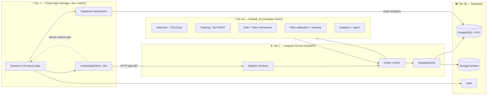
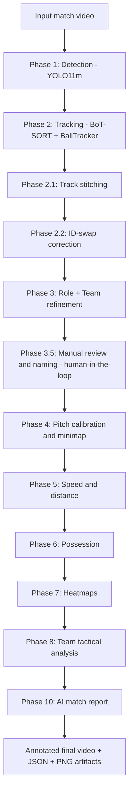
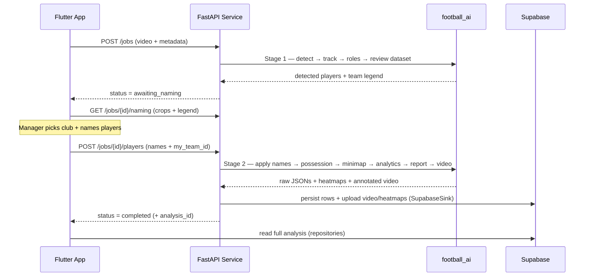
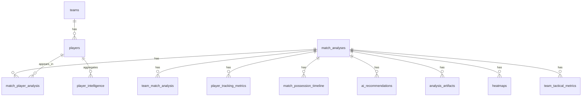
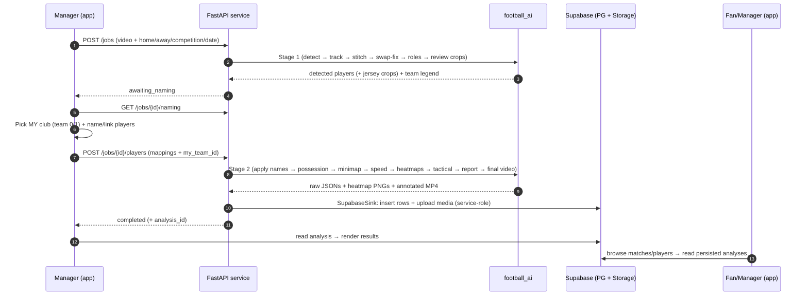

# GOALSIGHT — Complete Technical Documentation

> **AI‑Powered Football Match Analysis Platform**
> Computer‑vision tactical analytics from raw match video, delivered to managers and fans through a cross‑platform mobile app.
>
> *School of Computational Sciences and Artificial Intelligence (CSAI) — Zewail City of Science and Technology*

---

## Document control

| Field | Value |
|---|---|
| Project title | **GoalSight — AI‑Powered Football Match Analysis Platform** |
| Team number | 62 |
| Supervisor | Dr. Yousry Abdul Azeem  / Associate Professor at Zewail City of Science and Technology |
Student Name
Student ID
Program
Hesham Ashraf
202201477
SWD
Ahmed Sameh
202202152
SWD
Ahmed Amr
202201404
DSAI
Mohamed Wael
202201445
DSAI


| Submission date | June 2026 |
| Document purpose | Single source of truth for the system: the Flutter app, the AI computer‑vision model, the FastAPI analysis service, and the Supabase backend. Written to feed directly into the thesis chapters, the README, the poster, and the defense. |

> **How to use this document.** Each major section maps to one or more thesis chapters (see [§14 — Mapping to thesis chapters](#14--mapping-to-the-thesis-chapters)). Diagrams are written in Mermaid so they render on GitHub and can be exported for the report/poster.

---

## Table of contents

1. [Executive summary](#1--executive-summary)
2. [Problem statement, motivation & objectives](#2--problem-statement-motivation--objectives)
3. [System overview & high‑level architecture](#3--system-overview--high-level-architecture)
4. [The AI computer‑vision model (football_ai)](#4--the-ai-computer-vision-model-football_ai)
5. [The analysis service (FastAPI bridge)](#5--the-analysis-service-fastapi-bridge)
6. [The Flutter mobile application](#6--the-flutter-mobile-application)
7. [The database (Supabase / PostgreSQL)](#7--the-database-supabase--postgresql)
8. [End‑to‑end data flow (upload → analysis → display)](#8--end-to-end-data-flow-upload--analysis--display)
9. [Technology stack](#9--technology-stack)
10. [Setup, configuration & deployment](#10--setup-configuration--deployment)
11. [Testing & evaluation](#11--testing--evaluation)
12. [Ethics, compliance & standards](#12--ethics-compliance--standards)
13. [Known limitations & future work](#13--known-limitations--future-work)
14. [Mapping to the thesis chapters](#14--mapping-to-the-thesis-chapters)
15. [Appendix A — Output artifacts reference](#appendix-a--output-artifacts-reference)
16. [Appendix B — API reference](#appendix-b--api-reference)
17. [Appendix C — Full database table inventory](#appendix-c--full-database-table-inventory)

---

## 1 — Executive summary

**GoalSight** turns an ordinary broadcast or sideline football video into a structured tactical report. A manager uploads a match clip; a custom computer‑vision pipeline detects and tracks every player, the ball, goalkeepers and referees, assigns each player to a team, projects everyone onto a top‑down pitch model in real‑world metres, and derives analytics: possession, distance covered, speed, per‑player ratings, team tactical style, heatmaps, an annotated video, and a natural‑language match report. Results are persisted to a cloud database and surfaced in a polished Flutter mobile app with role‑based experiences for **managers**, **fans**, and **admins**.

The system is built as **three decoupled tiers**:

1. **AI model (`football_ai`)** — a Python computer‑vision pipeline (YOLO11m detection + BoT‑SORT tracking + appearance‑based team clustering + homography pitch calibration + analytics). Produces JSON artifacts, heatmap PNGs, and an annotated MP4.
2. **Analysis service** — a FastAPI application that wraps the model as a stateful HTTP job API and persists results to Supabase (Storage + Postgres).
3. **Flutter app** — a cross‑platform client (Android/iOS) that drives the upload → human‑in‑the‑loop naming → analysis → results workflow and renders every analytics screen.

A defining design choice is a **mandatory human‑in‑the‑loop step**: after automatic detection, the manager confirms which detected cluster is *their* club and (optionally) names players, guaranteeing that downstream analytics attach to the correct real‑world identities.

---

## 2 — Problem statement, motivation & objectives

### 2.1 Problem statement
Professional‑grade football analytics (possession maps, player load, tactical breakdowns) are expensive and locked behind enterprise platforms (e.g. Hudl, Wyscout, StatsBomb). Amateur clubs, academies, and individual coaches in regions like Egypt and the wider MENA area cannot afford these tools, nor the manual labour of tagging matches frame‑by‑frame. There is no affordable, self‑serve way to turn a phone‑recorded match into actionable tactical insight.

### 2.2 Motivation
- **Cost & access gap:** elite analytics is enterprise‑priced; grassroots football is priced out.
- **Manual analysis is slow & error‑prone:** human tagging of possession/positions is hours of work per match.
- **Computer vision is now viable on commodity data:** modern detectors/trackers (YOLO, BoT‑SORT) plus pitch homography make automated extraction feasible from a single camera.
- **Mobile‑first reality:** coaches and fans live on their phones; the deliverable should be an app, not a desktop suite.

### 2.3 Objectives
1. Detect and track ball, players, goalkeepers, and referees from a single‑camera match video.
2. Maintain **stable identities** across occlusions and crossings (ID stitching + swap correction).
3. Assign each player to a **team** automatically (jersey‑appearance clustering) with a human confirmation step.
4. Project tracks onto a **metric pitch model** via homography (manual or automatic keypoint calibration).
5. Derive **analytics**: possession, distance, speed, ratings, tactical style, heatmaps.
6. Produce an **annotated video** and a **natural‑language match report**.
7. Deliver everything through a **role‑based mobile app** (manager / fan / admin) backed by a secure cloud database.

### 2.4 Scope
- **In scope:** single‑video offline analysis; manager/fan/admin app; cloud persistence; club‑level multi‑tenancy.
- **Out of scope (current):** live/real‑time streaming analysis; multi‑camera fusion; event detection (goals, fouls, cards); biometric face recognition.

---

## 3 — System overview & high‑level architecture

GoalSight is a **3‑tier, decoupled** system. Each tier has a single responsibility and communicates through well‑defined contracts (HTTP + JSON, and the Supabase schema).



### 3.1 Responsibilities per tier

| Tier | Component | Responsibility |
|---|---|---|
| 1 | **Flutter app** | UI/UX, auth, role routing, upload workflow, human‑in‑the‑loop naming, rendering all analytics, reading persisted analyses from Supabase. |
| 2 | **Analysis service (FastAPI)** | Accepts video uploads, runs the model in two stages, serves crops/video, persists results to Supabase. Stateless HTTP, stateful in‑memory job store. |
| 3a | **football_ai model** | The computer‑vision pipeline. Pure Python; produces JSON/PNG/MP4 artifacts. |
| 3b | **Supabase** | Authentication, PostgreSQL with Row‑Level Security (multi‑tenant), Storage for videos/heatmaps. |

### 3.2 Why this split?
- **Separation of concerns:** the heavy GPU model is isolated from the app and the DB; either can evolve independently.
- **Deployability:** the model + service run on a GPU host (AWS) or a local WSL machine exposed via ngrok; the app talks to it over a single HTTP URL.
- **Resilience:** the service serves results directly *and* persists them; the app can render an analysis from the service's raw output even if cloud persistence is temporarily unavailable.

---

## 4 — The AI computer‑vision model (football_ai)

The model is a **10‑phase pipeline** orchestrated by `main.py`. Each phase reads the previous phase's artifact and writes its own, so every stage is independently inspectable and debuggable. The guiding invariant: **each stage saves a new output and never corrupts the previous one.**



### 4.0 Folder layout

```text
football_ai/
  main.py                     # orchestrator: CLI args, config overrides, runs each phase
  config/config.yaml          # all tunable parameters
  detection/                  # Phase 1 — YOLO detector, data models, pipeline
  tracking/                   # Phase 2 — BoT-SORT, ball tracker, stitcher, swap corrector
  role_refinement/            # Phase 3 — appearance extraction, team clustering, role decisions
  manual_correction/          # Phase 3.5 — review dataset, correction store, review UIs
  calibration/                # Phase 4 — homography, keypoint models, camera motion, minimap
  analytics/                  # Phases 5/6/7/8/9/10 — speed, possession, heatmaps, tactical, report
  visualization/              # annotator, pose overlay
  utils/                      # config loader, video IO, JSON export, logging
  weights/                    # YOLO weights (best.pt etc.)
  outputs/                    # all produced artifacts
  tests/                      # pytest suite (mostly weight/GPU-free)
```

### 4.1 Phase 1 — Detection (YOLO11m)
- **Module:** `detection/detector.py`, `detection/pipeline.py`, `detection/data_models.py`.
- **Model:** a **custom‑trained YOLO11m** detector (`weights/best.pt`) with **4 classes**: `0=ball`, `1=goalkeeper`, `2=player`, `3=referee`.
- **Per‑class confidence thresholds** (the ball is small/fast and needs a *lower* bar; players are easy and kept *high* to stay clean):

  | Class | Confidence threshold |
  |---|---|
  | ball | 0.20 |
  | player | 0.50 |
  | goalkeeper | 0.15 |
  | referee | 0.15 |

  Inference runs at the *minimum* required threshold, then `_passes_threshold` filters per class.
- **Key params:** `image_size: 1280`, `iou_threshold: 0.50`, `device: auto/cpu/cuda:0`.
- **Output:** `<stem>_detections.json` (per‑frame boxes) + optional annotated MP4.

### 4.2 Phase 2 — Tracking (BoT‑SORT + dedicated BallTracker)
- **Module:** `tracking/botsort_tracker.py`, `tracking/ball_tracker.py`, `tracking/models.py`.
- **Players/GK/referee:** Ultralytics **BoT‑SORT** (Kalman + IoU + GMC camera‑motion compensation). ByteTrack is available as an alternative backend.
- **Ball:** a **bespoke `BallTracker`** because the ball is tiny and fast (consecutive boxes can have zero IoU). It uses: inflated bbox for matching, center‑distance fallback when IoU is zero, velocity prediction across short gaps, confirmation after 2 consecutive hits, and **ball IDs starting at 9000+** so they never collide with player IDs.
- **Output:** `<stem>_tracks.json` (per‑frame `track_id` + class + bbox).

### 4.3 Phase 2.1 — Track stitching
- **Module:** `tracking/track_stitcher.py`.
- **Problem solved:** occlusions/missed detections cause BoT‑SORT to break one player into multiple IDs.
- **Logic:** re‑link a new ID to an old one when it reappears near the predicted location within `max_frame_gap`, with compatible bbox size and (optionally) a **jersey‑appearance gate** so two different‑team players are never merged.
- **Output:** `<stem>_tracks_stitched.json`.

### 4.4 Phase 2.2 — ID‑swap correction
- **Module:** `tracking/swap_corrector.py`.
- **Problem solved:** when two players cross, their IDs can swap while *both* tracks continue (stitching can't catch this).
- **Logic:** sample shirt colours per track → cluster the two teams → detect a track that suddenly flips team → find the partner that flipped the opposite way at the same time/place → exchange the IDs over the swap window. Also splits "drift" tracks.
- **Output:** `<stem>_tracks_swapfixed.json`.

### 4.5 Phase 3 — Role & team refinement
- **Module:** `role_refinement/` (`appearance_extractor.py`, `team_clusterer.py`, `role_refiner.py`).
- **Pipeline:** sample frames per track → crop the **jersey region** → HSV histogram with grass suppression → **spherical k‑means** (no scikit‑learn) to find the two teams → temporal voting + trajectory heuristics to decide each track's role.
- **Decision rules:** ball passes through as `ball`; players → team 0/1 from clustering; outliers → referee/goalkeeper from position+motion; the detector's referee prior is respected when refinement is unsure; unknown tracks are auto‑resolved by nearest team/position/neighbour when `resolve_unknowns=true`.
- **Output:** `<stem>_roles.json` (`track_id`, `detected_class`, `refined_role`, `role_confidence`, `team_id`, `role_reason`).

### 4.6 Phase 3.5 — Manual review & naming (human‑in‑the‑loop)
- **Module:** `manual_correction/correction_runner.py` (+ `correction_store.py`, review UIs).
- **What it does:** builds a **review dataset** — for each non‑ball track it extracts representative **crops** sampled across the track (see below), and writes a manifest the app consumes on the **Player Naming** screen.
- **Frame sampling (`representative_frame_ids`):** the track is split into *N* (default **9**) contiguous segments and **one random frame per segment** is chosen — guaranteeing full start→end coverage *and* per‑player variety (different poses), so the review crops are not near‑identical consecutive frames.
- **In the app:** the manager (1) picks which detected cluster (team 0/1) is **their** club, and (2) optionally names players / links them to existing squad members. This is **mandatory** — analytics only attach to correct identities after this confirmation.
- **Output:** `<stem>_roles_final.json` (final roles with names), `<stem>_role_corrections.json`, review crops under `outputs/manual_review/<stem>/`.

### 4.7 Phase 4 — Pitch calibration & minimap
- **Module:** `calibration/` (`homography.py`, `pitch_keypoints.py`, `nbjw_keypoints.py`, `camera_motion.py`, `minimap.py`).
- **Homography sources (in precedence):** explicit `--calibration` file → fixed per‑video file (`<stem>_homography.json` / `<stem>_pitch_calibration.json`) → **auto‑calibration** from a pitch‑keypoint model (`yolo_pose` 28‑kp default, or `nbjw` 57‑kp HRNet) → manual click‑to‑calibrate UI.
- **Camera‑motion smoothing:** anchors are propagated across frames so the minimap follows the camera without snapping.
- **Projection:** each object's foot point (ball: bbox centre) is mapped from image pixels to **field metres**; off‑pitch blow‑ups are rejected; positions are smoothed/clamped.
- **Output:** `<stem>_field_positions.json` (metric positions per object/frame), `<stem>_minimap.mp4`, and the composited `<stem>_final_with_minimap.mp4`.

### 4.8 Phase 5 — Speed & distance
- **Module:** `analytics/speed_distance.py`.
- Computes per‑track distance between consecutive valid field samples, converts to **km/h**, rejects implausible jumps above `max_speed_kmh`, applies a moving average, and summarises distance by team/role.
- **Output:** `<stem>_analytics.json`.

### 4.9 Phase 6 & 9 — Possession
- **Module:** `analytics/possession.py`.
- **Image‑space estimate (Phase 6):** find the ball centre → nearest player/GK foot point within a bbox‑height gate → last‑touch model for loose balls → hysteresis to avoid frame‑to‑frame flicker.
- **Field‑space possession (Phase 9):** the more accurate metric version computed from projected positions; writes the authoritative `<stem>_possession.json` (team 0/1 percentages, timeline, dominant team).

### 4.10 Phase 7 — Heatmaps
- **Module:** `analytics/` (`collect_positions`, `density_grid`, `save_heatmap`).
- Produces per‑team density heatmaps and **best‑player** heatmaps (player who covered the most ground) as PNGs: `<stem>_team{0,1}_heatmap.png` and `<stem>_team{0,1}_best_player_heatmap.png`.

### 4.11 Phase 8 — Team tactical analysis
- **Module:** `analytics/` tactical functions.
- Derives **explainable** tactical labels per team with human‑readable reasons: team shape (Wide/Balanced/Compact), compactness (metres from centroid), pressure style (Mid Block/High Press from block height), build‑up style, attacking zone (% activity per channel), transition speed (from avg km/h). Each label ships with a `reasons` string.
- **Output:** `<stem>_team_tactical.json` (with per‑team `metrics` + `reasons`).

### 4.12 Phase 10 — AI match report
- **Module:** `analytics/` report builder.
- Synthesises everything into a natural‑language **match report**: dominant team, **man of the match** & weakest player (by rating), per‑player ratings (0–10) with impact/insight/fatigue labels, key insights, and coaching recommendations.
- **Output:** `<stem>_final_report.json`.

### 4.13 Configuration model
`utils/config_loader.py` parses `config/config.yaml` into typed dataclasses. CLI flags override YAML. Major sections: `model`, `classes`, `video`, `visualization`, `debug`, `tracking` (+ `stitching`, `swap_correction`), `role_refinement`, `manual_correction`, `calibration`, `minimap`, `minimap_overlay`, `possession`, `pose`, `analytics`. A single `--all` flag enables the full pipeline.

### 4.14 The `--reuse-tracks` invariant
Manual labels and corrections are keyed to `track_id`. A fresh detection pass renumbers IDs, so the model only applies human edits when their file timestamp is newer than the tracks file (a freshness gate), or when `--reuse-tracks` re‑uses the prior, most‑processed tracks JSON (swap‑fixed → stitched → raw). This keeps human labels valid across re‑runs.

---

## 5 — The analysis service (FastAPI bridge)

The service (`app/goal_sight/analysis_service/`) wraps the model as a **stateful, multi‑step HTTP job API** and persists results to Supabase. It imports the model's own `main.py` functions and drives them in **two stages** with a human‑in‑the‑loop pause in between.



### 5.1 Modules
| File | Responsibility |
|---|---|
| `app/main.py` | FastAPI app, all HTTP endpoints, file serving, CORS, `/health`. |
| `app/jobs.py` | In‑memory **`JobStore`** — job lifecycle, status, background threads, two‑stage run, persistence call. |
| `app/model_runner.py` | Imports the model lazily (heavy: torch/ultralytics) and drives Stage 1 / Stage 2 exactly as `main.py` does. |
| `app/supabase_sink.py` | Maps the model's raw JSONs into the Supabase schema; uploads video/heatmaps to Storage; runs with the **service‑role key** (bypasses RLS, stamps `owner_club_id`). |
| `app/schemas.py` | Pydantic request/response models (`DetectedPlayer`, `NamingData`, `AnalysisResult`, …). |
| `app/settings.py` | Env‑driven config (model dir, device, Supabase URL/key, buckets, public base URL). |

### 5.2 Job lifecycle (status enum)
`queued → detecting → awaiting_naming → analyzing → completed` (or `failed`). Stage 1 ends at `awaiting_naming` (the mandatory pause); Stage 2 ends at `completed`.

### 5.3 Persistence (`SupabaseSink`)
Maps the model output → adapted schema, all stamped with the club's `owner_club_id`:
- `final_report` → `match_analyses` header + `ai_recommendations` + team blocks.
- `team_tactical` → `team_match_analysis` (labels) + `team_tactical_metrics`.
- `player_analytics` + `final_report` → `match_player_analysis` (per‑player verdict; home‑club players resolved/created in `players`).
- `speed_distance` → `player_tracking_metrics`.
- `possession` → `match_analyses` summary + `match_possession_timeline`.
- **all five JSONs** → `analysis_artifacts` (verbatim, `artifact_type='model_output'`).
- video + heatmaps → **Storage** (signed URLs stored on the rows).

> **Operational note.** Persistence requires `SUPABASE_URL` and `SUPABASE_SERVICE_KEY` env vars. If they are unset, the service **skips persistence** (and logs a loud warning at startup and per job). The app can still render the result from the service's raw output, but the match won't appear in history/squad until persistence succeeds. `GET /health` reports `"supabase": true/false`.

---

## 6 — The Flutter mobile application

A cross‑platform (Android/iOS) client built with **Flutter 3 / Dart**, **Riverpod** state management, and **GoRouter** navigation. Three role‑based experiences share one design system.

### 6.1 Project structure (dual‑layer)
The codebase has two coexisting trees (both active):

| Tree | Used for |
|---|---|
| `lib/features/manager/` | Manager screens, widgets, upload workflow |
| `lib/features/auth/`, `lib/features/admin/` | Auth & admin controllers/state |
| `lib/presentation/screens/fan/`, `…/admin/` | Fan & admin screens |
| `lib/presentation/state_management/` | App‑wide Riverpod providers |
| `lib/shared/` | Reusable primitives (charts, animations, components) |
| `lib/core/` | Theme, responsive utils, services, Supabase config |
| `lib/data/` | Models, repositories, remote data sources, services |

### 6.2 State management & navigation
- **Riverpod** (`StateNotifierProvider`) — providers in `lib/presentation/state_management/app_providers.dart`. Auth drives role routing: `AuthController → AuthState → routerProvider` redirects to `/fan`, `/manager`, or `/admin`.
- **GoRouter** — flat routes; objects passed via `state.extra`; custom transitions (`slideLeft`, `fade`, `modal`).
- The manager shell uses `IndexedStack` + a bottom nav: **Home → Matches → Upload → Players → Profile**.

### 6.3 Role experiences
- **Manager:** dashboard, matches, **upload & analyze workflow** (the core flow), squad/players, profile.
- **Fan:** clubs, standings, match analyses, player heatmaps, profile.
- **Admin:** club overview, squad management, analytics, bootstrap.

### 6.4 The upload & analysis workflow (the heart of the app)
`lib/features/manager/screens/upload_match_screen.dart` is a step machine:
`fileSelection → matchDetails → confirmation → processing → (Player Naming) → success / failed`.

1. **File selection / match details / review.**
2. **Processing (Stage 1):** `AnalysisApiClient` (Dio) creates the job, polls status, fetches the **naming** payload (detected players + crop galleries + team legend).
3. **Player Naming screen** (`player_naming_screen.dart`): the mandatory human‑in‑the‑loop step. Each card shows a **multi‑frame crop gallery** (high‑quality rendering, full‑screen pinch‑zoom), the detected **role**, a **jersey‑number badge** when read, and a name field with **squad auto‑match** by shirt number. The manager picks which team is their club.
4. **Processing (Stage 2):** names submitted; the service runs the full analysis.
5. **Success:** the analysis is fetched (from Supabase if persisted, or **built client‑side from the service's raw output** as a fallback so it always opens) and shown with the annotated video, ratings, tactical summary, heatmaps.

### 6.5 Data layer (repository pattern)
Interfaces in `lib/data/repositories/interfaces/`, Supabase implementations in `…/supabase/`. Key repositories: `SupabaseAnalysisRepository`, `SupabasePlayerRepository`, `SupabaseClubRepository`, `SupabaseUploadRepository`, `SupabaseManagerRepository`, `SupabaseStorageRepository`. A `CacheService` provides TTL caching; `AppError` standardises errors. `SupabaseAnalysisRepository._mapAnalysis` rebuilds the nested `MatchAnalysisModel` (header + team blocks + per‑player rows) the UI consumes; `MatchAnalysisModel.fromServiceResult` builds the same model directly from the model's raw JSON when cloud persistence is unavailable.

### 6.6 Design system
All tokens in `lib/core/theme/app_theme.dart`: dark premium palette (`background #050816`, surfaces, `primaryBlue/primaryPurple/accentCyan/accentGreen`), text styles, radii, spacing, gradients, shadows. Transparency always uses `.withValues(alpha:)`. Responsive scaling via a `ResponsiveContext` extension. Reusable animated charts in `lib/shared/widgets/` (`GsAnimatedBar`, `GsStatRing`, `GsPitchWidget`, `GsRadarChart`, …) and UX polish in `lib/shared/animations/` (`GsAiLoader`, `GsShimmer`, `GsSuccessOverlay`, `GsPullRefresh`).

### 6.7 Key dependencies
`supabase_flutter`, `flutter_riverpod`, `go_router`, `dio`, `flutter_secure_storage`, `video_player`, `fl_chart`, `printing` (PDF reports), `google_sign_in`, `google_fonts`, `shimmer`, `flutter_dotenv`, `image_picker`, `socket_io_client`. (See [`pubspec.yaml`](app/goal_sight/pubspec.yaml).)

---

## 7 — The database (Supabase / PostgreSQL)

A **38‑table** PostgreSQL schema on Supabase with **Row‑Level Security (RLS)** for club‑level multi‑tenancy. Every analytics row carries `owner_club_id`; RLS policies scope reads to the caller's club. The analysis service writes with the **service‑role key** (bypassing RLS, stamping the club explicitly); the app reads as the authenticated user.

### 7.1 Core analysis tables



| Table | Role |
|---|---|
| `match_analyses` | One row per analysed match (header: teams, scores/ratings, dominant team, possession, intensity, video & heatmap URLs, MOTM). |
| `team_match_analysis` | Per‑team block (side home/away, style, pressure, compactness, possession, avg rating, attacking zones). |
| `team_tactical_metrics` | Raw per‑team tactical metrics (compactness_m, width_m, depth_m, centroids, block height, avg speed) + reasons. |
| `match_player_analysis` | Per‑player verdict (rating, performance status, impact, insight, work rate, fatigue/activity labels, distance, speeds, MOTM/worst, heatmap URL). |
| `player_tracking_metrics` | Raw per‑track speed/distance metrics. |
| `match_possession_timeline` | Per‑frame possession (frame, team). |
| `ai_recommendations` | Recommendations + key insights (kind, text, sort_order). |
| `analysis_artifacts` | Verbatim model JSONs (`model_output`) — the lossless record of every run. |
| `heatmaps` | Heatmap rows (scope team/best_player, model_team_id, signed URL). |

### 7.2 Domain & app tables (selection)
`teams` (clubs), `players`, `player_intelligence` (aggregated per‑player intelligence, updated by trigger on insert), `player_risk_analysis`, `managers`, `team_managers`, `profiles`, `upload_jobs`, `videos`, `matches`, `match_events`, `match_players`, `tactical_insights`, `team_season_stats`, `player_match_stats`, plus fan/social tables (`fan_stats`, `achievements`, `user_achievements`, `user_favorite_players`, `user_favorite_teams`, `saved_matches`, `notifications`, `notification_preferences`, `activity_logs`), and subscription tables (`subscription_plans`, `user_subscriptions`). Full inventory in [Appendix C](#appendix-c--full-database-table-inventory).

### 7.3 Storage buckets
`match-videos` (annotated MP4s), `heatmaps` (PNGs), `reports`. Files are keyed by `{club_id}/…/{job_stem}` and served via long‑lived signed URLs stored on the rows.

---

## 8 — End‑to‑end data flow (upload → analysis → display)



**Resilience path:** if `SUPABASE_*` env vars are unset, persistence is skipped but the service still returns the full `raw` model output; the app builds `MatchAnalysisModel.fromServiceResult(...)` and renders the result anyway (history/squad still require persistence).

---

## 9 — Technology stack

| Layer | Technologies |
|---|---|
| **Mobile app** | Flutter 3, Dart, Riverpod, GoRouter, Dio, video_player, fl_chart, printing (PDF), google_sign_in, flutter_secure_storage |
| **AI / computer vision** | Python, **Ultralytics YOLO11m** (detection + pose), **BoT‑SORT** / ByteTrack (tracking), OpenCV, NumPy, custom spherical k‑means (team clustering), homography (manual + keypoint auto‑calibration, optional NBJW HRNet) |
| **Backend service** | FastAPI, Uvicorn, Pydantic, supabase‑py |
| **Cloud** | Supabase — PostgreSQL (+ RLS, triggers), Auth, Storage |
| **Infra / dev** | AWS GPU host or local WSL + ngrok tunnel; Docker (model image); Git/GitHub |

---

## 10 — Setup, configuration & deployment

### 10.1 AI model (standalone)
```bash
cd football_ai
python -m venv .venv && source .venv/bin/activate   # or .\.venv\Scripts\activate on Windows
pip install -r requirements.txt
# place detection weights at weights/best.pt
python main.py --video input_video.mp4 --all --device auto
# → outputs/<stem>_final_with_minimap.mp4 (+ all JSON/PNG artifacts)
```

### 10.2 Analysis service (WSL + ngrok, the demo setup)
```bash
# Terminal A — tunnel
ngrok http 8000        # copy the https URL

# Terminal B — service
cd app/goal_sight/analysis_service
export GOALSIGHT_MODEL_DIR="/path/to/football_ai"
export GOALSIGHT_DEVICE=cpu                         # or cuda:0 on a GPU host
export SUPABASE_URL="https://<project-ref>.supabase.co"
export SUPABASE_SERVICE_KEY="<service_role key>"    # server-only secret
export GOALSIGHT_PUBLIC_BASE_URL="https://<ngrok>.ngrok-free.app"
~/gsvenv/bin/python -m uvicorn app.main:app --host 0.0.0.0 --port 8000
# verify: open https://<ngrok>.ngrok-free.app/health  → {"status":"ok","supabase":true,...}
```

### 10.3 Flutter app
```bash
cd app/goal_sight
flutter pub get
# point the app at the service in app/goal_sight/.env:
#   ANALYSIS_API_URL=https://<ngrok>.ngrok-free.app
flutter run -d emulator-5554
```

### 10.4 Critical env vars
| Variable | Where | Purpose |
|---|---|---|
| `GOALSIGHT_MODEL_DIR` | service | path to `football_ai` |
| `GOALSIGHT_DEVICE` | service | `cpu` / `cuda:0` |
| `SUPABASE_URL`, `SUPABASE_SERVICE_KEY` | service | **persistence** (without these, results are not saved) |
| `GOALSIGHT_PUBLIC_BASE_URL` | service | absolute crop/video URLs for the app |
| `ANALYSIS_API_URL` | app `.env` | the service URL the app calls |

> **Speed reality:** on CPU the model is ~4 s/frame, so a full match takes hours. For demos use a **short clip** (seconds), pre‑run one analysis, or use a GPU host. The integration is identical; only the wait differs.

---

## 11 — Testing & evaluation

### 11.1 AI model
- **`pytest` suite** in `football_ai/tests/`, designed to run **without weights or GPU**: detector tests use a fake YOLO model; pipeline tests inject a fake tracker/model; tracking tests use synthetic detections; calibration/minimap/analytics/manual‑correction have independent unit tests.
- **CV evaluation metrics** (recommended for the thesis): detection precision/recall/mAP per class; tracking **ID switches / MOTA / IDF1**; homography **reprojection error (metres)** — the pipeline already logs and warns above a threshold; possession/speed sanity vs. manual ground truth on a labelled clip.

### 11.2 App & service
- `flutter analyze` (static analysis, enforced clean), `flutter test` (widget tests).
- Service: manual integration runs through the full job lifecycle; `/health` for liveness; structured logs for persistence success/failure.
- DB integrity verified via SQL queries (row counts per analysis: teams, players, tracking, timeline, recommendations, heatmaps).

### 11.3 Experimental setup to document
Hardware (CPU vs. GPU host, RAM, GPU model), dataset (clips used, resolution, FPS, durations), configurations (image size, thresholds, tracker buffer), and the methodology (which clips, what ground truth, which metrics).

---

## 12 — Ethics, compliance & standards

- **Privacy by design.** The system identifies players by **jersey number and team colour, not faces** — there is no biometric face recognition. Review crops are full‑body and transient.
- **Data minimisation & tenancy.** Each club's data is isolated by `owner_club_id` + **Row‑Level Security**; the service‑role key is **server‑only** and never shipped in the app.
- **Consent & ownership.** Managers upload their own match footage; analytics attach only to a club's own squad after explicit human confirmation (the naming step). Opponent tracks are stored name‑only (no `player_id`).
- **Fairness & transparency.** Tactical labels are **explainable** (each ships a human‑readable `reasons` string); ratings are derived from measurable on‑pitch activity, not opaque scores.
- **Security.** Secrets via environment variables; signed, expiring Storage URLs; auth via Supabase (JWT). Follows OWASP‑style input handling at the API boundary (size/empty checks, path‑traversal guards on file serving).
- **Reliability/safety.** Each pipeline stage is fault‑isolated (`_safe` wrappers) so one failing section never aborts the rest; the app degrades gracefully when persistence is unavailable.
- **Honest limitations disclosed** (see next section) — no fabricated goals/scores; the model reports only what it can measure.

**Standards to cite in the thesis:** GDPR data‑protection principles (minimisation, purpose limitation), OWASP Top 10 (API/security), ISO/IEC 25010 (software quality — maintainability/usability/reliability), and responsible‑AI / explainability guidelines.

---

## 13 — Known limitations & future work

### 13.1 Current limitations (honest)
- **No event detection:** goals, fouls, cards, passes are not detected → scorelines and goals/assists/tackles are not produced (ratings/possession/positions are).
- **Single camera, offline:** no live streaming or multi‑camera fusion.
- **Calibration sensitivity:** broadcast cuts/zoom can raise homography reprojection error and distort metric analytics.
- **Compute:** CPU inference is hours‑per‑match; a GPU is needed for full clips.
- **Identity from jersey, not face:** broadcast resolution makes faces unrecoverable; identification relies on number/colour + the human naming step.

### 13.2 Future work
- Event detection (goals/passes/shots) via temporal action models → real scorelines and richer per‑player stats.
- Real‑time/edge inference and multi‑camera support.
- Auto jersey‑number OCR to pre‑fill the naming step.
- xG / expected‑threat models on top of the field positions.
- Season‑level aggregation dashboards and opponent scouting.
- On‑device model distillation for faster, cheaper inference.

---

## 14 — Mapping to the thesis chapters

| Thesis chapter | Source sections in this document |
|---|---|
| Ch.1 Introduction | §1, §2 |
| Ch.2 Market & business case | §2.1–2.2, §13 (positioning vs. Hudl/Wyscout/StatsBomb) |
| Ch.3 Literature & background | §4 (YOLO, BoT‑SORT, homography, k‑means), §9 |
| Ch.4 System design | §3, §6.1–6.2, §7 (architecture, ERD, data flow) |
| Ch.5 Implementation | §4, §5, §6, §10 (module‑by‑module) |
| Ch.6 Testing & evaluation | §11 |
| Ch.7 Results & discussion | §11.1 metrics + §13 limitations/trade‑offs |
| Ch.8 Ethics, compliance & standards | §12 |
| Ch.9 Conclusions & future work | §13 |
| Appendix 1 User guide | §10 + §6.4 (workflow) |
| Appendix 2 | §13, Appendices A–C |

---

## Appendix A — Output artifacts reference

`<stem>` = uploaded video name (the job id in the service).

| File | Produced by | Meaning |
|---|---|---|
| `<stem>_detections.json` | Phase 1 | raw per‑frame detections |
| `<stem>_tracks.json` | Phase 2 | raw per‑frame tracks |
| `<stem>_tracks_stitched.json` | Phase 2.1 | re‑linked broken IDs |
| `<stem>_tracks_swapfixed.json` | Phase 2.2 | ID swaps fixed |
| `<stem>_roles.json` | Phase 3 | auto roles/teams |
| `<stem>_role_corrections.json` | Phase 3.5 | manual corrections |
| `<stem>_roles_final.json` | Phase 3.5 | final roles + names |
| `<stem>_pitch_calibration.json` / `<stem>_homography.json` | Phase 4 | calibration / homography |
| `<stem>_field_positions.json` | Phase 4 | metric positions per object/frame |
| `<stem>_minimap.mp4` | Phase 4 | top‑down minimap |
| `<stem>_final_with_minimap.mp4` | Phase 4 | **the final annotated video** |
| `<stem>_analytics.json` | Phase 5 | speed & distance |
| `<stem>_possession.json` | Phase 6/9 | possession % + timeline |
| `<stem>_team{0,1}_heatmap.png` + `_best_player_heatmap.png` | Phase 7 | heatmaps |
| `<stem>_team_tactical.json` | Phase 8 | team tactical labels + reasons |
| `<stem>_player_analytics.json` | Phase 6 | per‑player ratings/insight |
| `<stem>_final_report.json` | Phase 10 | natural‑language match report |

## Appendix B — API reference

| Method & path | Purpose |
|---|---|
| `POST /jobs` | Create a job (multipart video + match metadata) → `job_id`. |
| `GET /jobs/{id}` | Status + progress (poll). |
| `GET /jobs/{id}/naming` | Detected players + crop URLs + team legend (after Stage 1). |
| `POST /jobs/{id}/players` | Submit names + `my_team_id` → starts Stage 2. |
| `GET /jobs/{id}/result` | Final result: `analysis_id`, video URL, heatmap URLs, **raw model JSONs**. |
| `GET /jobs/{id}/crops/{name}` | Serve a jersey‑crop image (naming UI). |
| `GET /jobs/{id}/files/{kind}` | Serve analyzed video / heatmap / field positions. |
| `DELETE /jobs/{id}` | Cancel a job. |
| `GET /health` | Liveness + `model_present` + `supabase` config flag. |

## Appendix C — Full database table inventory

38 base tables (public schema):

`achievements`, `activity_logs`, `ai_recommendations`, `analysis_artifacts`, `fan_stats`, `heatmaps`, `highlights`, `managers`, `match_analyses`, `match_events`, `match_player_analysis`, `match_players`, `match_possession_timeline`, `matches`, `notification_preferences`, `notifications`, `player_intelligence`, `player_match_stats`, `player_risk_analysis`, `player_tracking_metrics`, `players`, `profiles`, `saved_matches`, `subscription_plans`, `tactical_insights`, `team_managers`, `team_match_analysis`, `team_season_stats`, `team_tactical_metrics`, `teams`, `tracking_snapshots`, `upload_jobs`, `user_achievements`, `user_favorite_players`, `user_favorite_teams`, `user_subscriptions`, `venues`, `videos`.

---

*Generated as the consolidated technical reference for the GoalSight graduation project. Fill in the team/supervisor/student placeholders on the cover before submission.*
