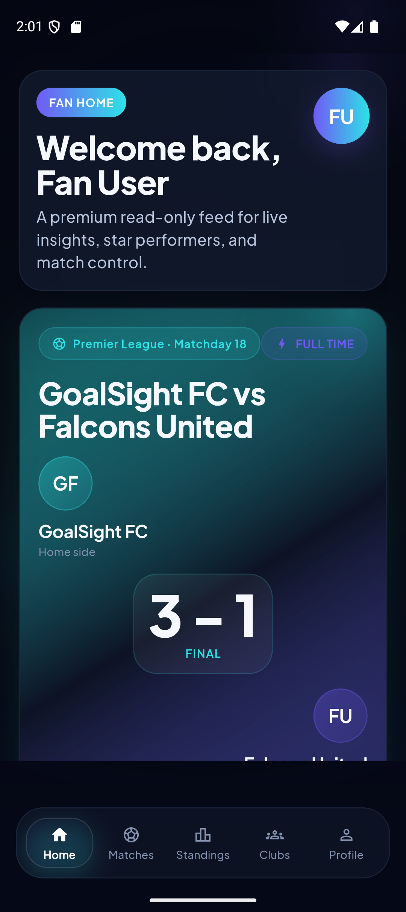
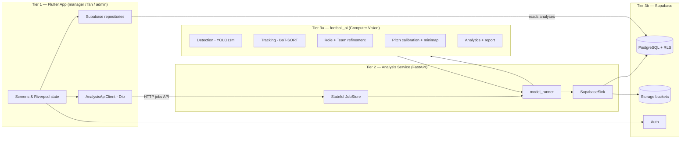

# ⚽ GoalSight — AI-Powered Football Match Analysis Platform

> Turn an ordinary match video into a structured tactical report.
> A custom computer-vision pipeline detects and tracks every player, the ball,
> goalkeepers and referees; projects them onto a metric pitch model; and derives
> possession, distance, speed, per-player ratings, tactical style, heatmaps, an
> annotated video, and a natural-language match report — delivered to managers,
> fans, and admins through a cross-platform mobile app.

<p align="center">
  
</p>

> **Graduation Project — Team 62**
> School of Computational Sciences and Artificial Intelligence (CSAI),
> Zewail City of Science and Technology.

---

## Table of contents

1. [Team Members](#team-members)
2. [Supervisor](#supervisor)
3. [Problem Statement](#problem-statement)
4. [Features](#features)
5. [System Architecture](#system-architecture)
6. [Technologies Used](#technologies-used)
7. [Setup Instructions](#setup-instructions)
8. [Deployment Instructions](#deployment-instructions)
9. [Usage Guide](#usage-guide)
10. [Screenshots / Demo](#screenshots--demo)
11. [Repository Structure](#repository-structure)
12. [Documentation](#documentation)

---

## Team Members

| Name | ID | Program |
|---|---|---|
| Hesham Ashraf | 202201477 | SWD (Software Development) |
| Ahmed Sameh | 202202151 | SWD (Software Development) |
| Ahmed Amr | 202201404 | DSAI (Data Science & AI) |
| Mohamed Wael | 202201445 | DSAI (Data Science & AI) |

## Supervisor

**Dr. Yousry Abdul Azeem** — Associate Professor, Zewail City of Science and Technology.

---

## Problem Statement

Professional-grade football analytics (possession maps, player load, tactical
breakdowns) are expensive and locked behind enterprise platforms such as Hudl,
Wyscout, and StatsBomb. Amateur clubs, academies, and individual coaches in
regions like Egypt and the wider MENA area cannot afford these tools, nor the
hours of manual labour required to tag a match frame-by-frame. **There is no
affordable, self-serve way to turn a phone-recorded match into actionable
tactical insight.**

GoalSight closes that gap. Modern detectors and trackers (YOLO, BoT-SORT) plus
pitch homography make automated extraction feasible from a single camera, and
coaches already live on their phones — so the deliverable is a mobile app, not a
desktop suite. A defining design choice is a **mandatory human-in-the-loop
step**: after automatic detection the manager confirms which detected cluster is
*their* club and (optionally) names players, guaranteeing that downstream
analytics attach to the correct real-world identities.

---

## Features

- **End-to-end video analysis** — upload a single-camera match clip and receive
  a full tactical report.
- **Detection & tracking** — custom-trained YOLO11m detector (ball / player /
  goalkeeper / referee) with BoT-SORT tracking, track stitching, and ID-swap
  correction for stable identities through occlusions and crossings.
- **Automatic team assignment** — jersey-appearance clustering (spherical
  k-means) splits the two teams, followed by a human confirmation step.
- **Pitch calibration** — homography (manual or automatic keypoint calibration)
  projects every object onto a real-world metric pitch model.
- **Analytics** — possession (image- and field-space), distance covered, speed
  (km/h), per-player ratings (0–10), team tactical style, and heatmaps.
- **Annotated output video** — top-down minimap composited onto the match video.
- **AI match report** — natural-language summary: dominant team, man of the
  match, weakest player, key insights, and coaching recommendations.
- **Human-in-the-loop naming** — a mandatory review screen with multi-frame
  jersey-crop galleries, detected role, jersey-number badge, and squad
  auto-match by shirt number.
- **Role-based mobile app** — distinct experiences for **Managers**, **Fans**,
  and **Admins**, backed by a secure multi-tenant cloud database.
- **PDF reporting** — printable match reports from the app.
- **Multi-tenancy & security** — club-level data isolation via `owner_club_id`
  and PostgreSQL Row-Level Security; Supabase Auth (JWT); signed, expiring
  storage URLs.

---

## System Architecture

GoalSight is a **3-tier, decoupled** system. Each tier has a single
responsibility and communicates through well-defined contracts (HTTP + JSON and
the Supabase schema).



| Tier | Component | Responsibility |
|---|---|---|
| 1 | **Flutter app** | UI/UX, auth, role routing, upload workflow, human-in-the-loop naming, rendering all analytics, reading persisted analyses from Supabase. |
| 2 | **Analysis service (FastAPI)** | Accepts video uploads, runs the model in two stages, serves crops/video, persists results to Supabase. Stateless HTTP, stateful in-memory job store. |
| 3a | **football_ai model** | The 10-phase computer-vision pipeline. Pure Python; produces JSON/PNG/MP4 artifacts. |
| 3b | **Supabase** | Authentication, PostgreSQL with Row-Level Security (multi-tenant), Storage for videos/heatmaps. |

A full architecture deep-dive, ER diagrams, and data-flow sequence diagrams are
in [GOALSIGHT_TECHNICAL_DOCUMENTATION.md](GOALSIGHT_TECHNICAL_DOCUMENTATION.md).

---

## Technologies Used

| Layer | Technologies |
|---|---|
| **Frontend (mobile app)** | Flutter 3 / Dart, Riverpod (state), GoRouter (navigation), Dio (HTTP), `video_player`, `fl_chart`, `printing` (PDF), `google_sign_in`, `flutter_secure_storage` |
| **Backend service** | FastAPI, Uvicorn, Pydantic, supabase-py |
| **AI / ML** | Python, Ultralytics **YOLO11m** (detection + pose), **BoT-SORT** / ByteTrack (tracking), OpenCV, NumPy, custom spherical k-means (team clustering), homography calibration (manual + keypoint auto-calibration, optional NBJW HRNet) |
| **Database / Cloud** | Supabase — PostgreSQL (+ RLS, triggers), Auth, Storage |
| **DevOps / Infra** | AWS GPU host or local WSL + ngrok tunnel; Docker (model/service image); Git / GitHub |

---

## Setup Instructions

> Full, step-by-step instructions (including environment requirements and every
> environment variable) are in **[docs/SETUP.md](docs/SETUP.md)**. The condensed
> version follows.

### Prerequisites

- **Flutter** 3.x (Dart SDK `>=3.4.3 <4.0.0`) + Android Studio / Xcode
- **Python** 3.10+ (for the AI model and FastAPI service)
- A **Supabase** project (URL + anon key + service-role key)
- (Recommended) an **NVIDIA GPU** for the AI model; CPU works but is hours/match
- The trained YOLO weights placed at `football_ai/weights/best.pt`

### 1. AI model (`football_ai`)

```bash
cd football_ai
python -m venv .venv && source .venv/bin/activate   # Windows: .\.venv\Scripts\activate
pip install -r requirements.txt
# place detection weights at weights/best.pt
python main.py --video input_video.mp4 --all --device auto
```

### 2. Analysis service (FastAPI)

```bash
cd app/goal_sight/analysis_service
pip install -r requirements.txt
# configure analysis_service/.env (see docs/SETUP.md):
#   GOALSIGHT_MODEL_DIR=/path/to/football_ai
#   GOALSIGHT_DEVICE=cuda:0            # or cpu
#   SUPABASE_URL=...   SUPABASE_SERVICE_KEY=...
uvicorn app.main:app --host 0.0.0.0 --port 8000
# verify: open http://localhost:8000/health → {"status":"ok","supabase":true,...}
```

### 3. Flutter app

```bash
cd app/goal_sight
flutter pub get
# point the app at the service in app/goal_sight/.env:
#   ANALYSIS_API_URL=https://<service-url>
#   SUPABASE_URL=...   SUPABASE_ANON_KEY=...
flutter run -d emulator-5554
```

---

## Deployment Instructions

> Full deployment guide (AWS GPU + Docker, WSL + ngrok demo setup, building
> release APKs) is in **[docs/DEPLOYMENT.md](docs/DEPLOYMENT.md)**.

**Demo setup (WSL + ngrok):**

```bash
# Terminal A — public tunnel
ngrok http 8000                                    # copy the https URL

# Terminal B — service
cd app/goal_sight/analysis_service
export GOALSIGHT_MODEL_DIR="/path/to/football_ai"
export GOALSIGHT_DEVICE=cpu                         # or cuda:0 on a GPU host
export SUPABASE_URL="https://<project-ref>.supabase.co"
export SUPABASE_SERVICE_KEY="<service_role key>"    # server-only secret
export GOALSIGHT_PUBLIC_BASE_URL="https://<ngrok>.ngrok-free.app"
uvicorn app.main:app --host 0.0.0.0 --port 8000
```

**Production (AWS EC2 GPU + Docker):** launch a `g4dn.xlarge` (NVIDIA T4) with a
Deep Learning AMI, mount the `football_ai` model + weights as a volume, build the
service image, and run it with `--gpus all` behind HTTPS. See
[docs/DEPLOYMENT.md](docs/DEPLOYMENT.md).

> **Persistence note:** the service only saves analyses when `SUPABASE_URL` and
> `SUPABASE_SERVICE_KEY` are set. Without them the app still renders results from
> the service's raw output, but matches won't appear in history/squad.
> `GET /health` reports `"supabase": true/false` so you can confirm.

> **Speed reality:** on CPU the model is ~4 s/frame, so a full match takes hours.
> For demos use a **short clip** (a few seconds), pre-run one analysis, or use a
> GPU host. The integration is identical; only the wait differs.

---

## Usage Guide

> A detailed, role-by-role walkthrough with the full upload workflow is in
> **[docs/USER_GUIDE.md](docs/USER_GUIDE.md)**.

The core flow (Manager role):

1. **Sign in** (or use a demo account) — the app routes you to the manager
   dashboard based on your role.
2. **Upload & Analyze** — pick a match video and enter match details (home/away
   team, competition, venue, date).
3. **Processing — Stage 1** — the service detects and tracks players, then pauses
   at the **Player Naming** screen.
4. **Player Naming (human-in-the-loop)** — review the multi-frame jersey crops,
   **pick which detected team is your club**, and optionally name / link players
   to your squad. This step is **mandatory**.
5. **Processing — Stage 2** — the full analysis runs (possession, minimap, speed,
   heatmaps, tactical, report, annotated video).
6. **Results** — view the annotated video, per-player ratings, tactical summary,
   possession, and heatmaps; export a PDF report.

**Fans** browse clubs, standings, match analyses, and player heatmaps.
**Admins** manage clubs and squads and view club-wide analytics.

---

## Screenshots / Demo

Screenshots and sample model outputs live in **[docs/SCREENSHOTS.md](docs/SCREENSHOTS.md)**
and the [docs/screenshots/](docs/screenshots/) folder.

<p align="center">
  
</p>

---

## Repository Structure

```text
Grad_Project_GOAL_SIGHT/
├── README.md                              # this file
├── GOALSIGHT_TECHNICAL_DOCUMENTATION.md   # full technical reference (single source of truth)
├── docs/                                  # submission documentation
│   ├── README.md                          # docs index
│   ├── SETUP.md                           # setup + environment requirements
│   ├── DEPLOYMENT.md                      # deployment instructions
│   ├── USER_GUIDE.md                      # user documentation
│   ├── API.md                             # analysis-service API reference
│   ├── DATABASE_SCHEMA.md                 # Supabase / PostgreSQL schema
│   ├── SCREENSHOTS.md                     # screenshots & sample outputs
│   └── screenshots/                       # image assets
├── football_ai/  (Ai_models/ & root CV modules)  # Tier 3a — computer-vision pipeline
├── app/goal_sight/                        # Tier 1 — Flutter app
│   └── analysis_service/                  # Tier 2 — FastAPI bridge
└── supabase/migrations/                   # database migrations
```

> **Note:** the AI computer-vision code is the `football_ai` project referenced
> throughout the docs; the model is run on a GPU host and its weights
> (`weights/best.pt`) and large media artifacts are git-ignored.

---

## Documentation

| Document | Purpose |
|---|---|
| [GOALSIGHT_TECHNICAL_DOCUMENTATION.md](GOALSIGHT_TECHNICAL_DOCUMENTATION.md) | Complete technical reference: architecture, every pipeline phase, service, app, DB, ethics, limitations. |
| [docs/SETUP.md](docs/SETUP.md) | Step-by-step setup + environment requirements. |
| [docs/DEPLOYMENT.md](docs/DEPLOYMENT.md) | Deployment (AWS GPU + Docker, WSL + ngrok, release builds). |
| [docs/USER_GUIDE.md](docs/USER_GUIDE.md) | End-user guide for managers, fans, and admins. |
| [docs/API.md](docs/API.md) | Analysis-service HTTP API reference. |
| [docs/DATABASE_SCHEMA.md](docs/DATABASE_SCHEMA.md) | Supabase / PostgreSQL schema and table inventory. |
| [docs/SCREENSHOTS.md](docs/SCREENSHOTS.md) | Screenshots and sample outputs. |

---

## License

Academic graduation project — Zewail City of Science and Technology, 2026.
All rights reserved by the authors unless stated otherwise.

---

<p align="center">Made by <b>GoalSight — Team 62</b> ⚽</p>
