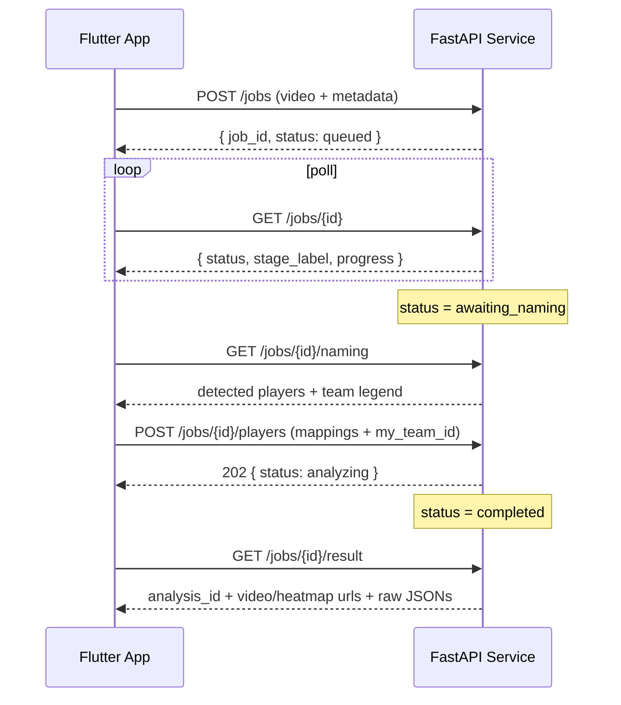

# API Documentation — Analysis Service

The **analysis service** is a FastAPI application that wraps the `football_ai`
computer-vision model as a stateful, multi-step HTTP job API and persists results
to Supabase. The Flutter app drives the whole upload → name → analyze → results
flow through these endpoints.

- **Base URL:** the value of `ANALYSIS_API_URL` (e.g. an ngrok or AWS HTTPS URL).
- **Content types:** `POST /jobs` is `multipart/form-data`; all other request
  bodies and responses are `application/json`.
- **Interactive docs:** FastAPI auto-serves OpenAPI at `/docs` (Swagger UI) and
  `/openapi.json`.
- **CORS:** open (`*`) for app access.

---

## Job lifecycle

A job moves through these statuses (the `status` field on every job response):

```
queued → detecting → awaiting_naming → analyzing → completed
                                                  ↘ failed
```

- **Stage 1** (`detecting`) ends at `awaiting_naming` — the mandatory
  human-in-the-loop pause.
- **Stage 2** (`analyzing`) ends at `completed`.



---

## Endpoints

### `GET /health`

Liveness + configuration probe.

**Response 200**

```json
{
  "status": "ok",
  "service": "goalsight-analysis",
  "model_dir": "/opt/football_ai",
  "model_present": true,
  "device": "cuda:0",
  "supabase": true
}
```

`supabase: false` means persistence is disabled (no `SUPABASE_URL` /
`SUPABASE_SERVICE_KEY`) — analyses won't be saved.

---

### `POST /jobs`

Create a job. `multipart/form-data`.

| Field | Type | Required | Notes |
|---|---|---|---|
| `video` | file | ✅ | the match video (rejected if empty) |
| `home_team` | string | – | match metadata |
| `away_team` | string | – | match metadata |
| `competition` | string | – | match metadata |
| `venue` | string | – | match metadata |
| `match_date` | string | – | match metadata |
| `club_id` | string | – | owning club (multi-tenancy) |
| `uploaded_by` | string | – | uploader user id |

**Response 200**

```json
{ "job_id": "abc123", "status": "queued" }
```

**Errors:** `400` — empty video upload.

---

### `GET /jobs/{job_id}`

Poll status and progress.

**Response 200**

```json
{
  "job_id": "abc123",
  "status": "detecting",
  "stage_label": "Tracking players",
  "progress": 0.42,
  "error": null
}
```

**Errors:** `404` — unknown job id.

---

### `GET /jobs/{job_id}/naming`

Fetch the detected players and team legend for the naming screen. Only valid
once the job is at `awaiting_naming`.

**Response 200**

```json
{
  "job_id": "abc123",
  "players": [
    {
      "track_id": 7,
      "auto_role": "player",
      "team_id": 0,
      "jersey_number": "10",
      "track_length": 540,
      "role_confidence": 0.91,
      "crop_url": "https://.../jobs/abc123/crops/track7_f120.jpg",
      "crop_urls": ["https://.../crops/track7_f10.jpg", "..."],
      "suggested_name": null
    }
  ],
  "team_legend": [
    {
      "team_id": 0,
      "label": "Red shirts",
      "color_rgb": [200, 30, 40],
      "crop_urls": ["https://.../crops/legend_team0.jpg"]
    }
  ]
}
```

**Errors:** `404` — unknown job id; `409` — job is not `awaiting_naming` yet.

---

### `POST /jobs/{job_id}/players`

Submit player names and confirm which detected team is the manager's club. This
**starts Stage 2**. `application/json`.

**Request body**

```json
{
  "mappings": [
    { "track_id": 7, "player_name": "Mohamed Salah", "player_id": "uuid-or-null" },
    { "track_id": 12, "player_name": "Player 12" }
  ],
  "my_team_id": 0
}
```

| Field | Type | Notes |
|---|---|---|
| `mappings[].track_id` | int | the detected track to label |
| `mappings[].player_name` | string | manager-entered name (may be temporary) |
| `mappings[].player_id` | string? | existing club player id, if linked |
| `my_team_id` | int | **must be `0` or `1`** — the detected team that is the manager's club |

**Response 202**

```json
{ "job_id": "abc123", "status": "analyzing" }
```

**Errors:** `404` — unknown job id; `400` — `my_team_id` not in `{0,1}`;
`409` — job not `awaiting_naming` / could not start analysis.

---

### `GET /jobs/{job_id}/result`

Fetch the final, normalized result. Valid only once `status == completed`.

**Response 200**

```json
{
  "job_id": "abc123",
  "my_team_id": 0,
  "analysis_id": "supabase-match-analyses-uuid-or-null",
  "analyzed_video_url": "https://.../jobs/abc123/files/video",
  "heatmap_urls": {
    "team0": "https://.../files/heatmap_team0",
    "team1": "https://.../files/heatmap_team1",
    "team0_best_player": "https://.../files/heatmap_team0_best_player"
  },
  "raw": {
    "final_report": { },
    "team_tactical": { },
    "player_analytics": { },
    "analytics": { },
    "possession": { }
  },
  "player_mapping": {
    "7": { "player_name": "Mohamed Salah", "player_id": "uuid" }
  }
}
```

- `analysis_id` is `null` when persistence is disabled (the app then renders from
  `raw`).
- `raw` preserves the model's JSON outputs **verbatim** (nothing renamed).

**Errors:** `404` — unknown job id; `409` — result not ready.

---

### `GET /jobs/{job_id}/crops/{name}`

Serve a jersey-crop image (`image/jpeg`) for the naming UI. Path-traversal
guarded (only the basename is used).

**Errors:** `404` — unknown job / crop not found.

---

### `GET /jobs/{job_id}/files/{kind}`

Serve a generated artifact. `kind` is one of:

| `kind` | Media type | File |
|---|---|---|
| `video` | `video/mp4` | the annotated `<stem>_final_with_minimap.mp4` |
| `field_positions` | `application/json` | metric positions per object/frame |
| `heatmap_<key>` | `image/png` | a heatmap PNG (e.g. `heatmap_team0`) |

**Errors:** `404` — no result / file not found / unknown kind.

---

### `DELETE /jobs/{job_id}`

Cancel a job.

**Response 200**

```json
{ "job_id": "abc123", "status": "failed" }
```

**Errors:** `404` — unknown job id; `409` — could not cancel.

---

## Error format

Unhandled errors return `500` with:

```json
{ "detail": "Internal error: <message>" }
```

Expected client errors use standard HTTP codes (`400`, `404`, `409`) with a
`detail` message, as noted per endpoint above.

---

## Endpoint summary

| Method & path | Purpose |
|---|---|
| `GET /health` | Liveness + `model_present` + `supabase` config flag |
| `POST /jobs` | Create a job (multipart video + metadata) → `job_id` |
| `GET /jobs/{id}` | Status + progress (poll) |
| `GET /jobs/{id}/naming` | Detected players + crop URLs + team legend (after Stage 1) |
| `POST /jobs/{id}/players` | Submit names + `my_team_id` → starts Stage 2 |
| `GET /jobs/{id}/result` | Final result: `analysis_id`, video/heatmap URLs, raw JSONs |
| `GET /jobs/{id}/crops/{name}` | Serve a jersey-crop image |
| `GET /jobs/{id}/files/{kind}` | Serve analyzed video / heatmap / field positions |
| `DELETE /jobs/{id}` | Cancel a job |
