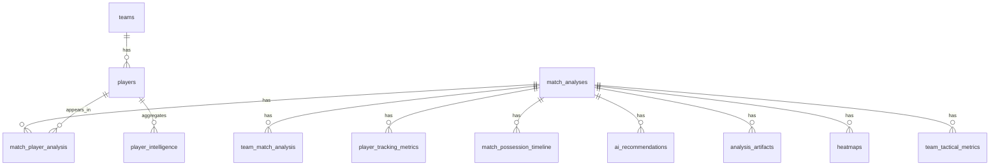

# Database Schema

GoalSight uses a **PostgreSQL** database hosted on **Supabase**, with
**Row-Level Security (RLS)** for club-level multi-tenancy.

- Every analytics row carries an **`owner_club_id`**; RLS policies scope reads to
  the caller's club.
- The **analysis service** writes with the **service-role key** (bypassing RLS,
  stamping `owner_club_id` explicitly).
- The **app** reads as the authenticated user (RLS enforced).
- Migrations live in [`../supabase/migrations/`](../supabase/migrations/).

> A deeper narrative (design rationale, the resilience path, storage keying) is
> in [GOALSIGHT_TECHNICAL_DOCUMENTATION.md §7](../GOALSIGHT_TECHNICAL_DOCUMENTATION.md#7--the-database-supabase--postgresql).

---

## Core analysis entity-relationship



---

## Core analysis tables

| Table | Role |
|---|---|
| `match_analyses` | One row per analysed match (header: teams, scores/ratings, dominant team, possession, intensity, video & heatmap URLs, man of the match). |
| `team_match_analysis` | Per-team block (side home/away, style, pressure, compactness, possession, avg rating, attacking zones). |
| `team_tactical_metrics` | Raw per-team tactical metrics (compactness_m, width_m, depth_m, centroids, block height, avg speed) + `reasons`. |
| `match_player_analysis` | Per-player verdict (rating, performance status, impact, insight, work rate, fatigue/activity labels, distance, speeds, MOTM/worst flags, heatmap URL). |
| `player_tracking_metrics` | Raw per-track speed/distance metrics. |
| `match_possession_timeline` | Per-frame possession (frame, team). |
| `ai_recommendations` | Recommendations + key insights (kind, text, sort_order). |
| `analysis_artifacts` | Verbatim model JSONs (`artifact_type = 'model_output'`) — the lossless record of every run. |
| `heatmaps` | Heatmap rows (scope team / best_player, model_team_id, signed URL). |

### How model output maps to the schema (`SupabaseSink`)

| Model output (raw JSON) | Persisted to |
|---|---|
| `final_report` | `match_analyses` header + `ai_recommendations` + team blocks |
| `team_tactical` | `team_match_analysis` (labels) + `team_tactical_metrics` (raw) |
| `player_analytics` + `final_report` | `match_player_analysis` (home-club players resolved/created in `players`) |
| `speed_distance` (`analytics`) | `player_tracking_metrics` |
| `possession` | `match_analyses` summary + `match_possession_timeline` |
| all five JSONs | `analysis_artifacts` (verbatim) |
| annotated video + heatmaps | **Storage** buckets (signed URLs stored on the rows) |

---

## Domain & application tables

- **Clubs / squad:** `teams` (clubs), `players`, `player_intelligence`
  (aggregated per-player intelligence, updated by trigger on insert),
  `player_risk_analysis`.
- **People / auth:** `managers`, `team_managers`, `profiles`.
- **Uploads / media:** `upload_jobs`, `videos`, `tracking_snapshots`, `highlights`.
- **Matches / events:** `matches`, `match_events`, `match_players`, `venues`,
  `tactical_insights`, `team_season_stats`, `player_match_stats`.
- **Fan / social:** `fan_stats`, `achievements`, `user_achievements`,
  `user_favorite_players`, `user_favorite_teams`, `saved_matches`,
  `notifications`, `notification_preferences`, `activity_logs`.
- **Subscriptions:** `subscription_plans`, `user_subscriptions`.

---

## Storage buckets

| Bucket | Contents |
|---|---|
| `match-videos` | annotated MP4s (`<stem>_final_with_minimap.mp4`) |
| `heatmaps` | heatmap PNGs (per team + best player) |
| `reports` | generated reports |

Files are keyed by `{club_id}/…/{job_stem}` and served via long-lived signed URLs
stored on the analysis rows.

---

## Full table inventory (38 base tables, `public` schema)

```text
achievements                 match_player_analysis        saved_matches
activity_logs                match_players                subscription_plans
ai_recommendations           match_possession_timeline    tactical_insights
analysis_artifacts           matches                      team_managers
fan_stats                    notification_preferences     team_match_analysis
heatmaps                     notifications                team_season_stats
highlights                   player_intelligence          team_tactical_metrics
managers                     player_match_stats           teams
match_analyses               player_risk_analysis         tracking_snapshots
match_events                 player_tracking_metrics      upload_jobs
                             players                      user_achievements
                             profiles                     user_favorite_players
                                                          user_favorite_teams
                                                          user_subscriptions
                                                          venues
                                                          videos
```

---

## Multi-tenancy & security model

1. **Isolation key.** Every analytics/domain row carries `owner_club_id`.
2. **RLS policies** scope `SELECT`/`INSERT`/`UPDATE`/`DELETE` to the caller's club
   (derived from their authenticated profile).
3. **Service-role writes.** The analysis service uses the service-role key,
   which bypasses RLS, and explicitly stamps `owner_club_id` on every inserted
   row — the key never ships in the app.
4. **Opponent privacy.** Opponent player tracks are stored name-only (no
   `player_id`); analytics attach to a club's own squad only after the explicit
   human naming step.
5. **Triggers.** `player_intelligence` is updated by a trigger when per-match
   player rows are inserted, keeping per-player aggregates current.
